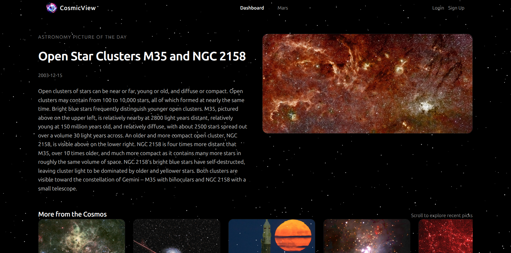
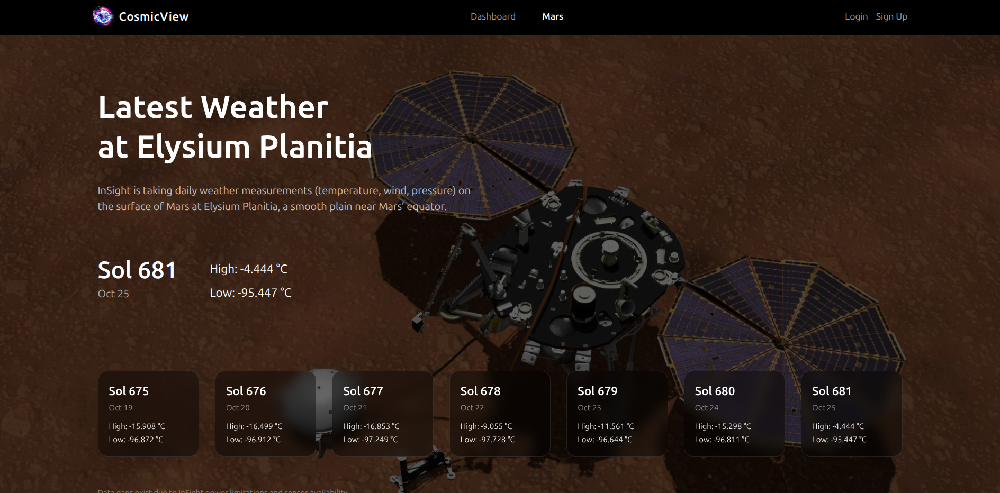
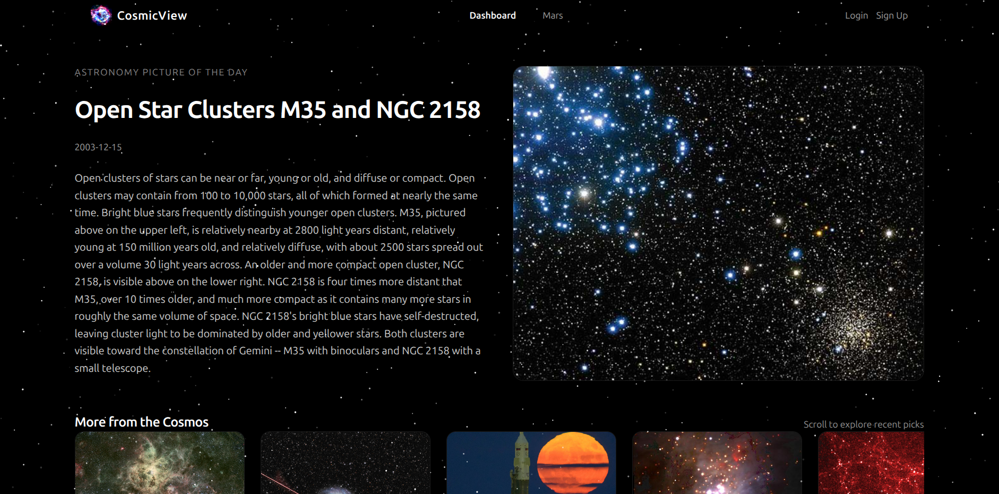
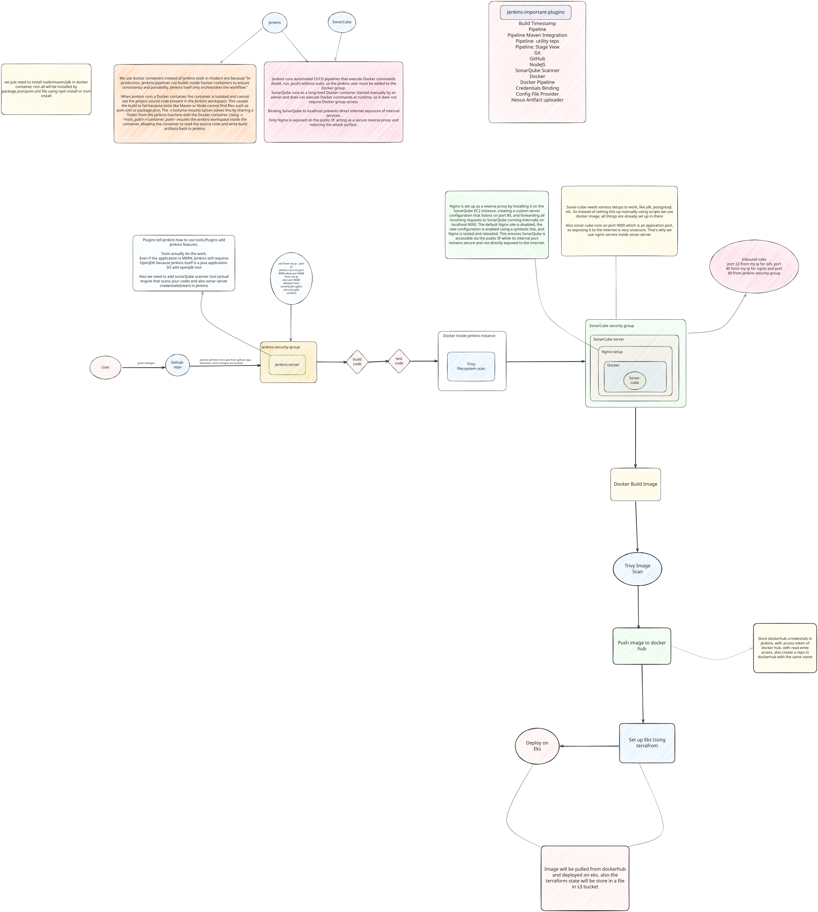

# CosmicView

CosmicView is a space-themed full-stack web app built with Next.js that lets you explore NASA data with a clean, modern UI. It is deployed **end-to-end with a production-grade CI/CD pipeline** on AWS EKS.

It includes a simple JWT-based auth flow, a dashboard that pulls **Astronomy Picture of the Day (APOD)** content, and a Mars weather view powered by NASA's InSight API.

> **⚠️ Note on Authentication Errors:** MongoDB Atlas automatically pauses free-tier clusters after a period of inactivity. If login or sign-up returns an error, the cluster is likely paused.

## Features

- **Auth**: Sign up, log in, log out (JWT stored in an HttpOnly cookie)
- **Dashboard**: NASA APOD (Astronomy Picture of the Day) gallery
- **Mars**: Latest InSight weather data
- **UI**: Tailwind + shadcn/ui components

## Screenshots

### Dashboard



### Mars Weather View



### Additional View



## Tech Stack

- Next.js (App Router)
- React
- TypeScript
- MongoDB + Mongoose
- JWT (`jsonwebtoken`)
- Tailwind CSS

---

## CI/CD Pipeline

This project includes a full end-to-end DevOps pipeline. The diagram below shows the complete architecture.



### Overview

The pipeline automates code quality checks, container builds, vulnerability scanning, and deployment to AWS EKS — triggered automatically on every push to GitHub.

```
GitHub Push → Jenkins → SonarQube → Docker Build → Trivy Scan → Docker Hub → EKS Deploy
```

---

### Pipeline Stages

| Stage           | Tool                       | Description                                                                          |
| --------------- | -------------------------- | ------------------------------------------------------------------------------------ |
| Source          | GitHub                     | Jenkins polls/webhooks on push events and fetches the latest code                    |
| Build           | Node.js (Docker container) | Runs `npm install` inside a Docker container volume-mounted to the Jenkins workspace |
| Test            | Node.js                    | Runs the test suite                                                                  |
| Code Quality    | SonarQube Scanner          | Static analysis and security scan; pipeline waits for the quality gate result        |
| Filesystem Scan | Trivy                      | Scans the project filesystem for vulnerabilities before building the image           |
| Docker Build    | Docker                     | Builds the application container image                                               |
| Image Scan      | Trivy                      | Scans the newly built Docker image for vulnerabilities                               |
| Push            | Docker Hub                 | Tags and pushes the image to Docker Hub (credentials stored securely in Jenkins)     |
| Deploy          | AWS EKS                    | Pulls the image from Docker Hub and deploys to the EKS cluster                       |

### Terraform / EKS Setup

Terraform provisions the EKS cluster. Remote state is stored in an S3 bucket to support team collaboration and state locking.

```bash
# From the terraform/ directory
terraform init    # initialise with S3 backend
terraform plan
terraform apply
```

After the cluster is live, configure `kubectl` to point at it:

```bash
aws eks update-kubeconfig --region <region> --name <cluster-name>
```

---

## Requirements

- Node.js 18+ (recommended)
- A MongoDB database (MongoDB Atlas works well)
- A NASA API key

## Environment Variables

Create a `.env` file in the project root:

```dotenv
MONGODB_URI=mongodb+srv://<user>:<password>@<cluster>/<db>
JWT_SECRET=<long-random-secret>
NASA_API_KEY=<nasa-api-key>
```

Notes:

- Do **not** commit `.env` to GitHub.
- On hosting platforms like Vercel, paste the **raw values** (no surrounding quotes).

---

## Local Setup

1. **Clone the repo**

```bash
git clone <your-repo-url>
cd cosmo-view
```

2. **Install dependencies**

```bash
npm install
```

3. **Create `.env`**

Create a `.env` file in the project root and set:

```dotenv
MONGODB_URI=...
JWT_SECRET=...
NASA_API_KEY=...
```

Where to get the values:

- `MONGODB_URI`: from MongoDB Atlas (Database → Connect → Drivers)
- `JWT_SECRET`: generate a long random string (32+ chars recommended)
- `NASA_API_KEY`: from https://api.nasa.gov/

4. **If using MongoDB Atlas, allow your IP**

MongoDB Atlas blocks connections by default. In Atlas:

- Security → Network Access → Add IP Address
- Add your current public IP (recommended for dev)

5. **Run the dev server**

```bash
npm run dev
```

Open http://localhost:3000.

6. **(Optional) Production build locally**

```bash
npm run build
npm run start
```

---

## Troubleshooting

### MongoDB connection error

If you see `MongooseServerSelectionError`, it's usually one of:

- Atlas Network Access doesn't include your IP
- Wrong username/password in `MONGODB_URI`
- Cluster is paused

## Scripts

- `npm run dev` — start dev server
- `npm run build` — production build
- `npm run start` — start production server
- `npm run lint` — run ESLint

## API Routes

- `POST /api/SignUp` — create account and set auth cookie
- `POST /api/logIn` — log in and set auth cookie
- `GET /api/logOut` — clear auth cookie
- `GET /api/session` — get current session user from JWT

## License

See [LICENSE](LICENSE).
